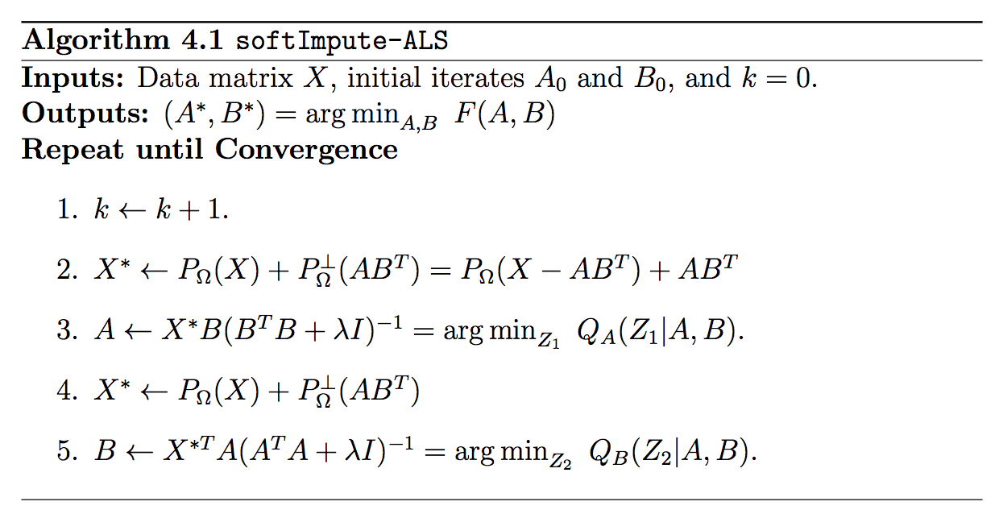

# SparkFastALS

We provide a distributed version of FastALS. 
The input matrix to be factored is split row-by-row across many machines. 
The transpose of the input is also split row-by-row across the machines. 
The current model (i.e. the current guess for `A`, `B`) 
is repeated and held in memory on every machine. Thus the total time taken 
by the computation is proportional to the number of non-zeros divided by the number of
 CPU cores, with the restriction that the model should fit in memory.

At every iteration, the current model is broadcast to all machines, 
such that there is only one copy of the model on each machine. 
Each CPU core on a machine will process a partition of the input matrix, 
using the local copy of the model available. 
This means that even though one machine can have many cores 
acting on a subset of the input data, all those cores can share the same 
local copy of the model, thus saving RAM. This saving is especially pronounced on machines with many cores.

SparkFastALS is a Spark package for modeling and fitting matrix factorization.
For more information on FastALS, see [our paper](http://www.stanford.edu/~rezab/papers/fastals.pdf).
This implementation is of Algorithm 4.1 in the paper.




## Compilation

To compile and run, run the following from the Spark root directory. Compilation:
```
sbt/sbt assembly
```
To run with 4GB of ram:
```
./bin/spark-submit --class org.apache.spark.mllib.examples.SparkFastALS  \
  ./examples/target/scala-2.10/spark-examples-1.1.0-SNAPSHOT-hadoop1.0.4.jar \
  --executor-memory 4G \
  --driver-memory 4G
```

# FastALS

For example, the following code fits a model outputting `ms` and `us` as the factors:

    // Iteratively update movies then users
    for (iter <- 1 to ITERATIONS) {
      println("Iteration " + iter + ":")

      // Update ms
      println("Computing new ms")
      ms = multByXstar(R, ms, us, minimizer(us))

      // Update us
      println("Computing new us")
      us = multByXstarTranspose(Rt, ms, us, minimizer(ms))
    }
       

## Missing data

The input is a [RowMatrix](http://spark.apache.org/docs/1.1.0/mllib-data-types.html#rowmatrix), 
which can handle sparse matrices, so the unobserved entries are 
simply not included in the sparse representation.